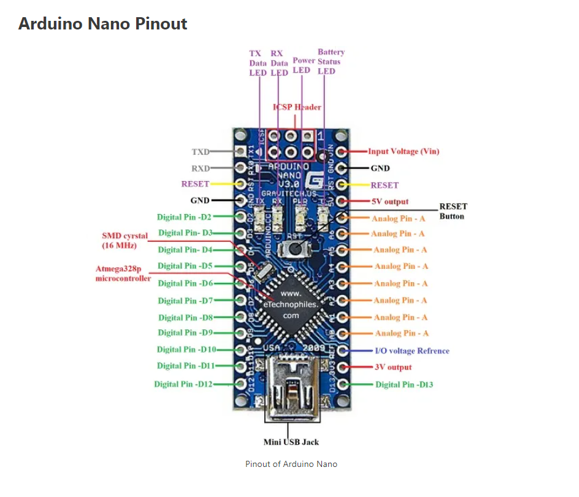
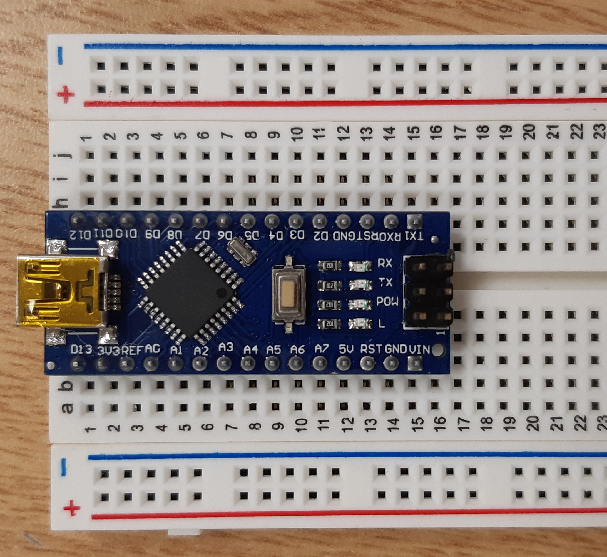

# DevFest2024
Windsor Google DevFest 2024 - High School Track
## Arduino Project Development

[1. Kit Assembly Instructions](https://youtube.com/playlist?list=PLiBItcliDLPd2GlCq3_gPH4e9Ii3d9XaE&si=MxE0Q9ForVchJnUR)
This YouTube playlist steps through every stage of the assembly process.

[2. Download Adruino IDE](https://www.arduino.cc/en/software)

[3. Arduino Language Reference](https://www.arduino.cc/reference/en/)

[4. Arduino Nano Overview](https://docs.arduino.cc/hardware/nano)

## Nano Pinout

  
Arduino is an open-source electronics platform based on easy-to-use hardware and software. It's intended for anyone making interactive projects.

They produce a wide variety of boards for a wide variety of needs. We will be using the Arduino nano. This is an inexpensive board that is perfect for small projects.

[5. L298N Overview](https://components101.com/modules/l293n-motor-driver-module)

[L298N In Depth](https://howtomechatronics.com/tutorials/arduino/arduino-dc-motor-control-tutorial-l298n-pwm-h-bridge/)

## L298N Pinout

The L298N is also called an H-Bridge. It is used for 2 reasons.
1. It allows us to direct voltage that is higher than our board can handle. We need this if we can our car to move with any speed at all.
2. It allows us to reverse to polarity on our votage. This allows us to spin the motors in the other direction.
